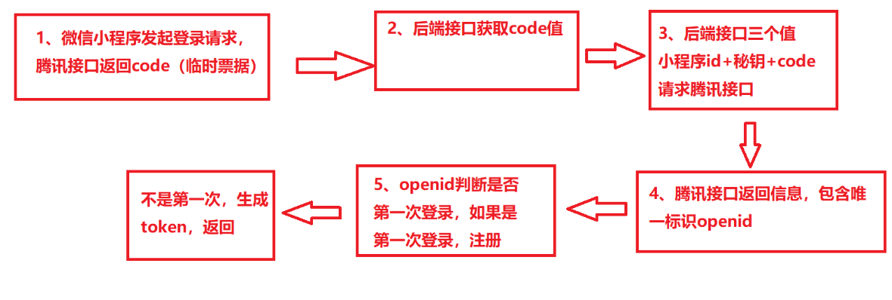

- 雪花算法的组成
https://blog.csdn.net/jam_yin/article/details/131107313
时间戳, 数据中心id, 机器id组成

- 微信授权登录, 中间发生了什么?
> https://developers.weixin.qq.com/miniprogram/dev/framework/open-ability/login.html
  1. 微信小程序发起登录请求, 腾讯接口返回code(临时票据)
  2. 后端接口获取code值
  3. 后端接口三个值(小程序id, 秘钥, code)请求腾讯接口
  4. 腾讯接口返回信息, (包含唯一标识openid, 会话秘钥session_key)
  5. openid判断是否第一次登录, 如果是第一次登录, 注册
  6. 不是第一次, 生成token返回

说说OAuth 2.0的认证流程?
> https://www.ruanyifeng.com/blog/2014/05/oauth_2_0.html
> https://www.technice.com.tw/experience/12520/

